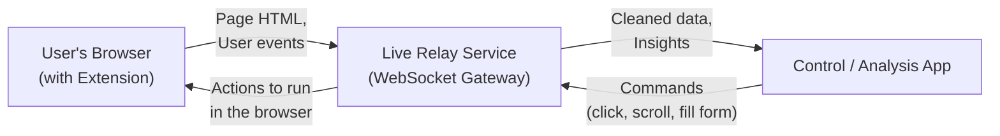
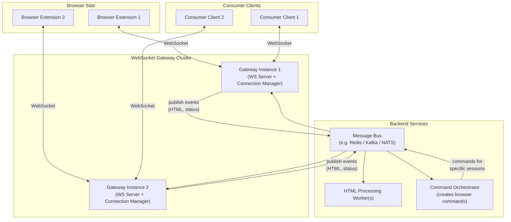
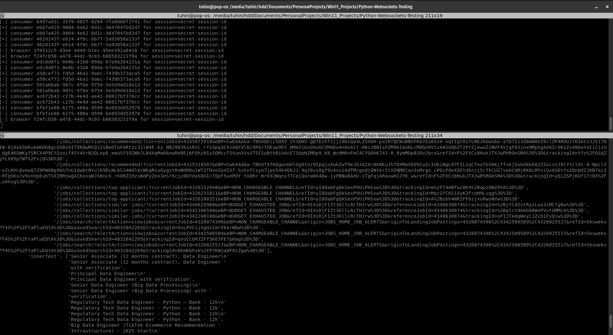

## What I want to create in this project?

I wanted to create a generic setup that will use any browser
and scrap ANY website by creating a live websocket connection between
the browser and a backend server.
Few example consumer scripts can be found in the [`example_consumers/`](./Websocket_Server_AND_Consumer/example_consumers/) folder.

**Main purpose:**

1. No sandbox environment needed (like playwright/selenium)
2. Works with any website (SPA, dynamic content, etc)
3. Real-time two-way communication (send commands back to browser)
4. Can work alongside real user actions (hybrid human+automation)
5. Use a LLM to spin up a consumer script withing few seconds, and start scraping live data with the same WS server.

## Purpose Diagram:

## Technical Architecture Diagram:

---

## ✔️ How it works — in 5 simple steps

**1. Install & enable the browser extension**
The extension watches the webpage you're on and securely connects to the live system.

**2. Start your connected app (the controller)**
This could be an automation tool, dashboard, or AI assistant that interacts with your webpage.

**3. The system links both sides automatically**
Your browser and controller pair together using a shared session — no setup required.

**4. Your browser sends live page content**
As you move, scroll, or browse, the extension shares updated webpage information with your controller.

**5. Control flows both ways**
Your controller can send actions like scroll, click, or fill form, and your browser executes them instantly.

## Python client subscription to the websocket server:

### What is the use ?

A compact, friendly comparison table, this might help you understand when to use this new approach over traditional scraping methods:

---

| Feature / Approach                    |     Scrapy    |   Playwright / Selenium   |    WebSocket-Based Two-Way Scraping    |
| ------------------------------------- | :-----------: | :-----------------------: | :------------------------------------: |
| Works without JS?                     |     ✅ Good    | ❌ Mostly needs JS runtime |        ❌ Depends on real browser       |
| Handles dynamic SPA apps              |     ❌ Weak    |     ⚠️ Moderate/Costly    |               ✅ Excellent              |
| Reacts to live page changes           |      ❌ No     |   ⚠️ Possible but heavy   |               ✅ Real-time              |
| Long-running logged-in sessions       |   ⚠️ Painful  |         ⚠️ Fragile        |         ✅ Persistent + Natural         |
| Works alongside real user actions     |      ❌ No     |       ❌ Not reliably      |             ✅ Built for it             |
| Evades bot detection / fingerprinting |     ❌ Weak    |  ⚠️ Tuned setups required |        ✅ Uses real user browser        |
| Automation + Human Hybrid             |      ❌ No     |          ⚠️ Hacky         |          🚀 Native capability          |
| Overhead per action                   |      Low      |            High           |                Very low                |
| Ideal Use Case                        | Bulk crawling | Full automation scripting | Live assist + interactive intelligence |

## Example linkedin job details crawled:

