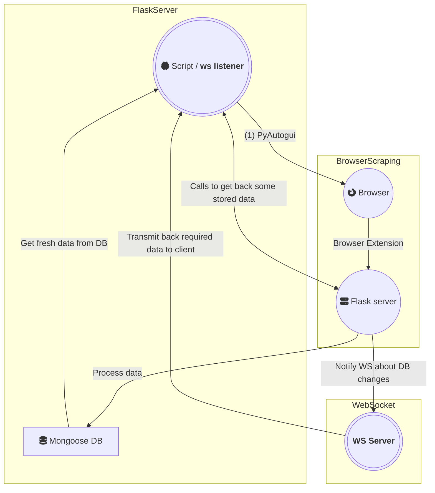

# Q1. What I want to create in this project?

=> I want to create a CLI based application that will use the firefox browser almost like how an user uses the browser
and scrap LinkedIn website for multiple purpose that I'll describe later on in the [docs](./docs).

___

## Steps:
1. User will run the script and it will start listening to the websocket server.
2. The script will also start a flask server that will be used to process the data and store it in the database.
3. The flask server is primarily responsible for getting browser data, from browser extension, and storing it in the database.
4. Once, there's is any update in data, the websocket server will notify the script about the changes.
5. The script will then fetch the data from the database and based on it, the rest of the process will continue.

## Workflow of the application:
1. User will start the websocket server.
2. User will start the main script. That'll do the following things:
   1. [Subscribe to the websocket server](#python-client-subscription-to-the-websocket-server).
   2. [Start scraping using pyautogui.](#scraping-using-pyautogui)

## Python client subscription to the websocket server:

### What is the use ?
=> The Python client will be responsible for sending scraping/running scripts commands to the browser via this websocket
connection.

#### workflow of the application:

**For example:**
If the Python client wants to find all `href` on a page, based on certain selector. It'll need to do this:
1. Use PyAutogui to load that page.
2. Use PyAutoGui to trigger the extension to listen to websocket server for any incoming command.
3. The websocket connection, that the Python client has been subscribed to, will send a command to the ws server,
   that'll forward the message to the extension.
4. After the extension receives the command, it'll execute the command, and send back the result to the ws server.
5. The ws server will then forward the result to the Python client.
6. All this time from (3), the Python client should be listening to the ws server for any incoming message.
7. Once, the Python client receives the result, it'll process it, and continue with the rest of the process.

## Scraping using PyAutoGui:
=> The main script will use PyAutoGui to control the browser. It'll do the following things:
1. Load the page on the browser (of user's choice, where the extension is installed).
2. Trigger the extension to listen to the websocket server for any incoming command.
3. Click on button by using given img sources
4. typewriting in the input text field.
