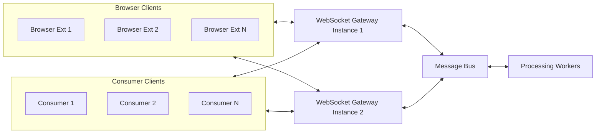

# 🧩 WebSocket Gateway Architecture — Technical Overview

## 1️⃣ High-Level Architecture

The system enables two-way communication between:

-   **Browser Extensions** (sending HTML snapshots or receiving commands)
-   **Consumer Clients** (processing incoming data or issuing automations back to the browser)

The WebSocket Gateway acts as a **relay**, while a message bus enables **scalability and decoupled processing**.

---

### 🏗 Architecture (Mermaid Diagram)



---

## 2️⃣ Core Concepts

### 🔹 Connection Object

Each WebSocket connection is represented by a `Connection` object storing:

-   `websocket` transport
-   unique `connection_id`
-   **bounded outgoing message queue**

This design prevents slow clients from overwhelming the system.

---

### 🔹 Reader & Writer Tasks

Every WebSocket connection spawns two async tasks:

| Task       | Direction                              | Responsibility                                    |
| ---------- | -------------------------------------- | ------------------------------------------------- |
| `reader()` | Client ➜ Gateway ➜ Message Bus / Logic | Receives HTML or commands                         |
| `writer()` | Gateway ➜ Client                       | Sends queued messages (with backpressure control) |

-   They run **concurrently**
-   The **reader controls lifecycle**
-   When the reader exits, the writer is safely cancelled

---

### 🔹 Backpressure via Bounded Queue

Outbound messages use a queue:

```python
asyncio.Queue(maxsize=100)
```

This ensures:

-   No unbounded memory growth
-   Slow clients do not stall the entire server

Policies when full may include:

-   Dropping messages (latest wins)
-   Blocking producers temporarily
-   Disconnecting misbehaving clients

---

## 3️⃣ Example Usage

### 🧪 Example Client 1 — Browser Simulator

```python
import asyncio, websockets, random

async def browser():
    async with websockets.connect("ws://localhost:8765") as ws:
        async def send_html():
            while True:
                await ws.send(f"<html>frame={random.randint(0,999)}</html>")
                await asyncio.sleep(1)

        async def listen():
            async for msg in ws:
                print("[Browser] Command:", msg)

        await asyncio.gather(send_html(), listen())

asyncio.run(browser())
```

---

### 🧪 Example Client 2 — Consumer Simulator

```python
import asyncio, websockets, random

async def consumer():
    async with websockets.connect("ws://localhost:8765") as ws:
        async def listen():
            async for msg in ws:
                print("[Consumer] HTML received:", msg)

        async def send_commands():
            cmds = ["click()", "scroll-down", "scroll-up"]
            while True:
                await ws.send(random.choice(cmds))
                await asyncio.sleep(2)

        await asyncio.gather(listen(), send_commands())

asyncio.run(consumer())
```

---

## 4️⃣ Design Goals

-   ⚡ Scalable to **100k+ concurrent connections**
-   🔁 Full **bidirectional messaging**
-   🚦 **Explicit backpressure control**
-   🧱 Stateless gateway layer (ideal for autoscaling)
-   🔒 Secure, extensible, observable design

---

## 5️⃣ Future Enhancements

| Feature                              | Purpose                              |
| ------------------------------------ | ------------------------------------ |
| Redis Streams / Kafka / NATS         | Horizontal scaling & message routing |
| Authentication & identity binding    | Client isolation and authorization   |
| Metrics (Prometheus / OpenTelemetry) | Operational monitoring               |
| Acknowledgement protocol (optional)  | Guaranteed delivery logic            |

---

### ✔ Summary

This architecture provides a robust foundation for real-time, large-scale, bidirectional communication between automated browser agents and consumer clients — while preventing bottlenecks, runaway memory growth, or coupling between nodes.

⚠️‼️

Yes! this is GPT generated content. But, the idea behind it is real.
