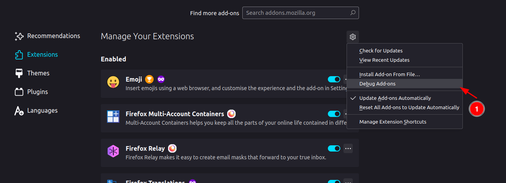
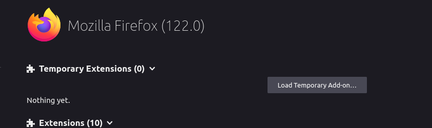

## How to load extension in firefox?

`SinifferEX` is not a signed extension, also not published into mozilla extension store.

To load this extension in firefox, you'll need to do the following things:

1. Open firefox and type `about:debugging` in the address bar.

2. Click on `This Firefox` on the left side. Or, you can directly go to `about:debugging#/runtime/this-firefox`

3. Click on `Load Temporary Add-on...` button.

4. Select the `manifest.json` file from the `extension` folder.

5. You'll see the extension loaded in the firefox.

